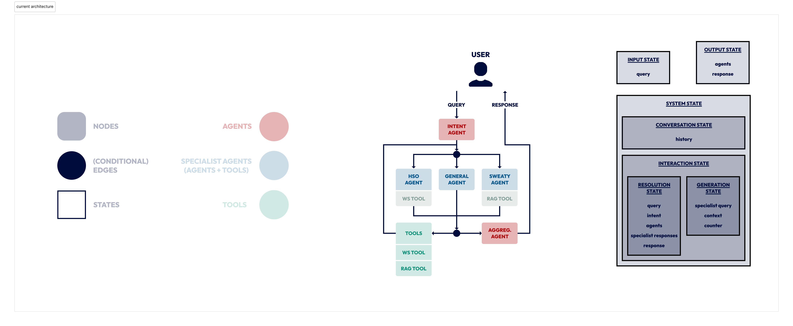

# SECo

**Sweaty Conversation Agent System** is a LangGraph-based conversational agent for
Hochschule Offenburg's humanoid robot Sweaty. It answers questions about the
university and the robot, and handles general conversation. Specialist agents use
web search and a local retrieval-augmented generation (RAG) knowledge base.

SECo is a cleaned-up fork of my university project, which I developed in the summer
semester of 2025 under the supervision of Prof. Dr. Daniela Oelke. The original
repository's latest commit is dated **5 July 2025**. The
recent commits here document its migration and cleanup; the core architecture and
technology choices reflect the original project rather than a newly designed stack.

## Setup

Use Python 3.13 and uv. Run these commands from the repository root:

```sh
uv sync --locked
cp .env.example .env
```

Set the following credentials in `.env`:

| Variable | Purpose |
| --- | --- |
| `OPENAI_API_KEY` | Access to the university's LLM proxy for chat and embeddings |
| `SERPER_API_KEY` | University web search through Google Serper |
| `TAVILY_API_KEY` | Required by the Tavily tool registered during startup |

The default proxy is `https://llm-proxy.imla.hs-offenburg.de`. The original
university deployment requires access through the HSO network/VPN. Credentials
are not included. Existing environment variables take precedence over `.env`.

## Run

```sh
uv run seco              # Terminal conversation; enter exit to quit
uv run seco --frontend   # Gradio interface
uv run seco --help       # Show options without initializing the graph
```

You can also run `uv run python -m seco.main` with the same options.
Startup builds the RAG index from `data/sweaty/`, which requires the embedding
service. The generated Chroma files are stored in `data/rag/` and logs in
`seco.log`; both are ignored by Git.

The current application uses a single conversation thread. The Gradio interface
is intended for a local demonstration, not isolated multi-user sessions.

## Configuration and architecture



- [Configuration](docs/configuration.md): models, prompts, paths, and graph identifiers.
- [Architecture and extension](docs/architecture.md): routing, states, registries,
  and adding agents or tools.

```text
src/seco/
├── config/   # Application defaults, agent prompts/models, graph identifiers
├── graph/    # Graph builder, nodes, tools, routing, and state models
├── utils/    # Registries, logging, timing, and shared containers
└── main.py   # Terminal and Gradio application
```

## Verification

```sh
uv run --locked python -m unittest discover -s tests -v
```

The smoke tests check CLI help without credentials, frontend construction, and a
two-turn general conversation through the graph with mocked external services.
They do not validate live proxy access, embeddings, or search results. To verify
those integrations, configure credentials and ask both a university question and
a robot question in the application.
